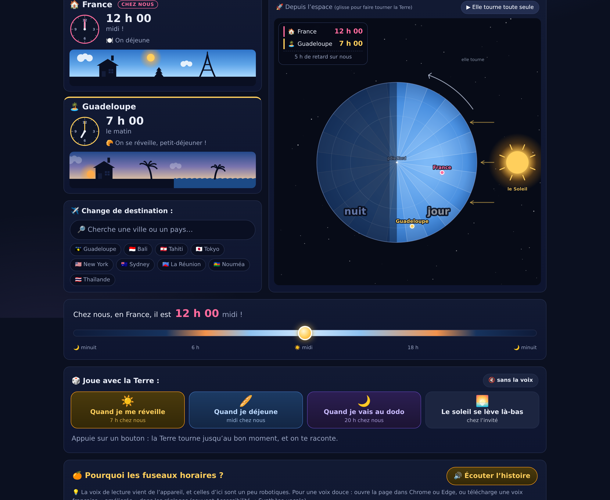
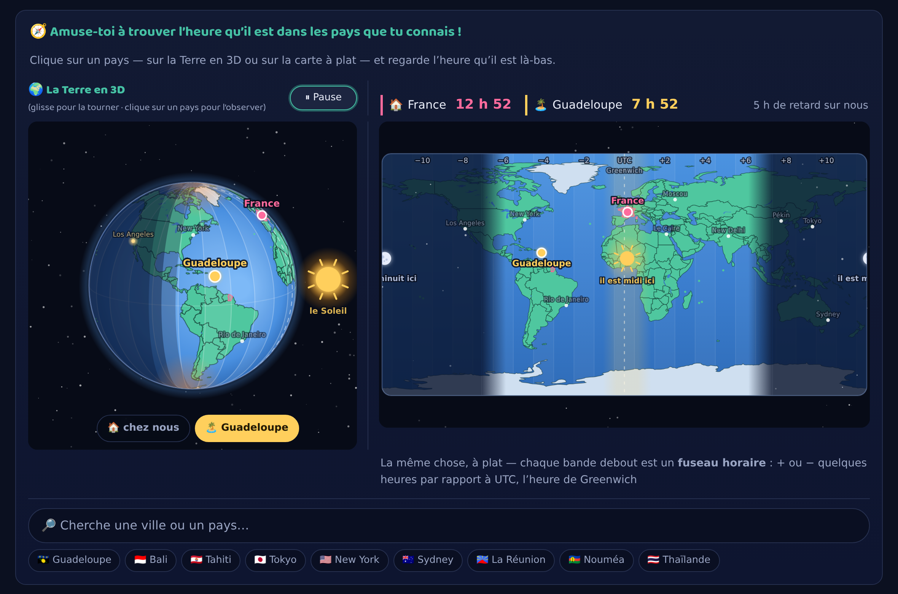
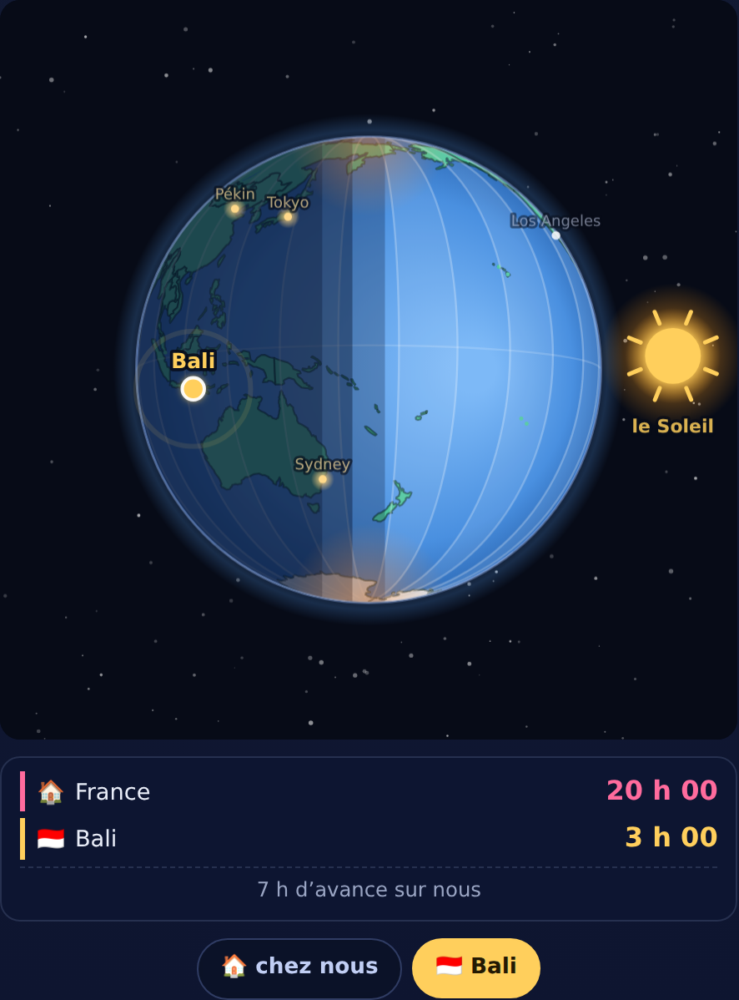
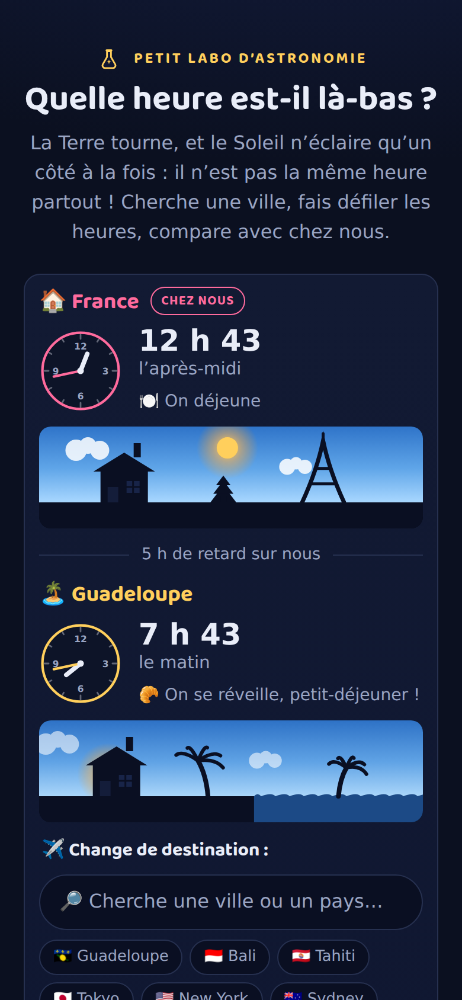

# Quelle heure est-il là-bas ? 🌍

Épisode 3 du **Petit labo d'astronomie** : un site d'une page, interactif, pour expliquer les
fuseaux horaires à une enfant de 5 ans, guidée par un parent qui lit à voix haute.

- La **Terre tourne sur elle-même en 24 heures** ; le Soleil, fixe, n'éclaire qu'un côté à la fois ;
- donc **il n'est pas la même heure partout** — la **France** (« chez nous ») se compare en direct
  avec une **destination** au choix : cherche une ville ou un pays, ou clique-le sur les cartes ;
- la Terre tourne vers l'est : le soleil se lève d'abord à Bali, puis en France, puis en Guadeloupe ;
- et quand c'est le soir chez nous, à Bali… **c'est déjà demain**.

*(Le dépôt garde son nom de travail `la-terre-tourne` — c'est le refrain de la série — comme
`eclipse-explorer` affiche « La mécanique des éclipses ».)*



## Fonctionnalités

- **Organisé comme l'épisode 2** : d'abord l'heure **chez nous** et **là-bas** (les deux
  cartes-horloges, avec la recherche juste dessous), puis la vue « 🚀 **Depuis l'espace** » à
  côté — la Terre vue de tout en haut, au-dessus du pôle Nord, le dessin des manuels en grand
  et en vivant : un disque découpé en **24 tranches comme une orange** (une par heure), le
  Soleil fixe à droite qui n'éclaire que la moitié qui lui fait face, la France et la
  destination posées chacune sur son cercle, qui tournent avec l'heure et passent du jour à
  la nuit. **On attrape le disque et on le fait tourner au doigt** (glisser rotatif) :
  l'heure suit le mouvement, dans le vrai sens de rotation de la Terre. Et en dessous, la
  **frise du temps court sur toute la largeur de la page**.
- **La recherche fonctionne sans Internet** : ≈ 220 villes et pays embarqués (accents ignorés,
  demi-fuseaux compris — cherche l'Inde !), 9 idées de voyage prêtes à cliquer (Guadeloupe,
  Bali, Tahiti, Tokyo…). Deux moteurs synchronisés, en haut de page et sur la carte à plat ;
  choisir un lieu fait pulser son point sur le disque, sans jamais changer l'heure.
- **Le cadre des deux heures**, posé sur la vue du pôle et répliqué sous le globe du jeu :
  l'heure en France, l'heure là-bas, et l'écart en toutes lettres (« 8 h d'avance sur
  nous »).
- **Deux cartes-horloges** (France + destination) : horloge analogique, grosse heure digitale,
  mot-repère (« midi ! », « la nuit »…), activité du moment, badge « **déjà demain !** » /
  « **encore hier !** », et le ciel local dessiné en continu — nuit étoilée, aube rose, grand
  jour, coucher orangé.
- **Grand curseur 0–24 h** (l'heure en France) : sa piste raconte elle-même la journée. La
  Terre peut aussi tourner toute seule (un tour en 80 s), boutons lecture/pause jumeaux sur le
  globe et sur la carte.
- **Quatre boutons-scénarios** : « Quand je me réveille (7 h) », « Quand je déjeune (midi) »,
  « Quand je vais au dodo (20 h) », « Le soleil se lève là-bas ». La Terre tourne en douceur —
  toujours vers l'est, son vrai sens ! — puis une petite histoire compare la France et la
  destination. Si la destination vit sur le **même fuseau que la France** (Allemagne,
  Italie…), la phrase célèbre la coïncidence (« c'est la même heure que chez nous ! ») au
  lieu de répéter l'heure. Et si on **change de destination**, l'histoire affichée se met à
  jour toute seule. Un bouton 🔇/🔊 active la **version sonore** : à chaque moment choisi, le
  conteur dit ce qui se passe chez nous et là-bas — même voix et même ton que l'histoire des
  fuseaux, avec les enchaînements ajoutés pour l'oral (« Chez nous… Et pendant ce temps, à
  Bali… »), la bonne préposition pour chaque lieu (« en Guadeloupe », « au Japon »,
  « aux Fidji », « au Caire »… — `placeLocative`, testée) et sans les émojis, imprononçables.
  Le choix est retenu.
- **La carte du monde à plat** (mêmes contours que le globe) : les 24 fuseaux en bandes
  étiquetées **par leur décalage UTC** (−11 … UTC … +11), la nuit qui balaie la carte d'est en
  ouest, un **halo doré** centré sur le vrai midi solaire, « Greenwich » écrit sous « UTC »,
  soleil « il est midi ici » et lune « il est minuit ici ». Glisser change l'heure, cliquer
  choisit la destination.



- **« Pourquoi les fuseaux horaires ? »** : la petite histoire des 24 tranches d'orange, à lire
  ou à **écouter** — la synthèse vocale du navigateur la raconte phrase à phrase, sur un ton de
  conteur (pauses, exclamations, suspens). Le site choisit d'office la voix française la plus
  naturelle de l'appareil, un menu 🗣 permet d'en changer (choix retenu), et un conseil
  s'affiche quand l'appareil n'a que des voix robotiques.
- **Le jeu « Amuse-toi à trouver l'heure qu'il est dans les pays que tu connais ! »**, après
  l'histoire : le **globe en 3D** puis la **carte à plat**. Le globe montre les vrais
  continents et les frontières des ~180 pays (Natural Earth, embarqué dans `js/geo.js` —
  aucune tuile, aucune bibliothèque), la France surlignée en rose, la destination en doré, les
  24 fuseaux en tranches. Glisser horizontalement le fait tourner (l'heure change), un clic
  sur un pays ou une ville-décor l'observe, et son heure s'affiche dans le cadre. Sur
  ordinateur, le globe et la carte s'affichent **côte à côte, sur un seul écran** ; sur petit
  écran, la Terre occupe davantage le cadre pour rester lisible.
- **Le Soleil du globe reste à sa place, et l'image reste lisible.** Il se pose sur l'axe
  horizontal, du côté d'où vient la lumière — et le cadrage garde **toujours la limite
  jour/nuit à l'écran** : jamais la face éclairée pile en face, jamais le Soleil coincé
  derrière la Terre. Un lieu en pleine nuit s'affiche vers le bord sombre, et les villes de la
  face nuit **allument leurs petites lumières**.



- **Choisir une destination ne fait jamais bouger l'heure** : sur le globe du jeu, c'est la
  caméra qui **vole en douceur** jusqu'au lieu (et contourne par la face nuit quand le Soleil
  doit changer de côté). Deux **boutons de lieux** sous le globe : 🏠 *chez nous* et la
  destination, à son nom (🌺 *Bali*…) — la sortie de secours quand on s'est perdu en glissant.
- **Rien ne recouvre jamais les vues** : dans le jeu, le cadre des heures et les boutons de
  lieux sont rangés sous le globe à toutes les tailles d'écran, et sous 640 px le cadre de la
  vue du pôle descend lui aussi sous le disque.
- Accessible : aria-labels sur tous les canvas, `prefers-reduced-motion` respecté (rien ne
  bouge tout seul), curseur utilisable au clavier, espace = pause.



## Lancer en local

Aucune dépendance, aucun build. Il faut juste un petit serveur statique
(les modules ES ne se chargent pas depuis `file://`) :

```bash
python3 -m http.server 8000
# ou : npx serve
```

puis ouvrir <http://localhost:8000>.

## Tests

Le modèle horaire, la géographie et le répertoire de lieux sont purs et se testent sous Node,
sans navigateur :

```bash
node test/model.test.mjs && node test/geo.test.mjs
```

**63 vérifications horaires**, dont les données exactes du récit : 12 h en France (hiver) → 7 h
en Guadeloupe et 19 h à Bali ; l'ordre des levers de soleil Bali → France → Guadeloupe ;
l'effet « déjà demain » (20 h chez nous = 3 h le lendemain à Bali) ; « encore hier » au petit
matin ; le miroir Bali/Guadeloupe (lever sur l'une ≈ coucher sur l'autre) ; les phrases
générées des scénarios et les écarts en toutes lettres (y compris les demi-fuseaux : l'Inde a
« 4 h 30 d'avance ») ; et les deux garanties du cadrage caméra (`cameraFrame`) : la limite
jour/nuit toujours à l'écran, le Soleil jamais caché derrière la Terre après un recadrage.

**25 vérifications géographiques** : Paris tombe dans la France surlignée, Tokyo au Japon, le
milieu du Pacifique dans l'océan, Bali/La Réunion/Tahiti ont leur île, la recherche trouve
« reunion » sans accent, chaque pays du répertoire a son polygone…

Le site est aussi vérifié en navigateur (Playwright/Chromium, desktop + mobile 390 px) : zéro
erreur de console, structure de la page (heures chez nous/là-bas d'abord puis « Depuis
l'espace », frise pleine largeur, jeu côte à côte sur ordinateur), glisser rotatif du disque
(un quart de tour ≈ 6 h), sélection sans changer l'heure, cadres jumeaux, boutons de lieux,
bascule 🔇/🔊 des scénarios, sondes de pixels sur la position du Soleil et le croissant de
nuit (jamais de « plein jour » plein cadre, Soleil entier même rapproché sur mobile).

## Déployer sur GitHub Pages

Le workflow `.github/workflows/deploy-pages.yml` publie le site à chaque push sur `main`.
Dans les réglages du repo : **Settings → Pages → Source : « GitHub Actions »**
(le workflow tente aussi de l'activer automatiquement au premier run).

## Le modèle horaire

Tout est dans [`js/model.js`](js/model.js) (aucun accès DOM, toutes les constantes des lieux) :

- **L'horloge de référence est l'heure de France** (UTC+1 en hiver) ; l'heure locale d'un lieu
  = UTC + son décalage, avec report de jour — c'est lui qui allume les badges « déjà demain » /
  « encore hier ». Les décalages en demi-heures (Inde +5 h 30, Népal +5 h 45) sont gérés.
- **L'heure solaire** d'un lieu = UTC + longitude/15 : il est midi solaire pile quand le lieu
  fait face au Soleil. C'est elle qui pilote toute la géométrie : la rotation du globe 3D, le
  point subsolaire, le terminateur et le halo de midi de la carte, la hauteur du soleil dans
  les ciels des vignettes.
- **Jour d'équinoxe** : lever à 6 h et coucher à 18 h solaires partout ;
  hauteur du soleil = sin(π · (h − 6) / 12).

## Ce que le site simplifie

- **L'heure d'été.** Le site vit en heure d'hiver (France UTC+1, écarts −5 h avec la Guadeloupe
  et +7 h avec Bali). En été, la France passe à UTC+2 et ces écarts deviennent −6 h / +6 h. Les
  villes cherchées sont aussi en heure standard, sans heure d'été.
- **Un équinoxe permanent.** Jour et nuit durent 12 h partout, le soleil se lève vers 6 h et se
  couche vers 18 h. En réalité, ça dépend de la saison et de la latitude ; le terminateur est
  donc vertical, sans courbe saisonnière.
- **Des bandes bien droites.** Les fuseaux sont dessinés en 24 tranches régulières de 15°. Les
  vraies frontières zigzaguent : des pays entiers choisissent l'heure du voisin — la France vit
  à l'heure de Berlin (UTC+1), pas à celle de Greenwich juste à côté. C'est pour ça qu'à
  12 h 00 pile, le halo doré du midi solaire est à 15° Est, un cran à l'est de la France — dès
  12 h 10, elle baigne dedans.
- **Heure civile vs heure solaire.** Les horloges affichent l'heure du fuseau, le ciel suit
  l'heure solaire (continue). D'où de petits écarts réalistes : à « midi » à l'horloge, le
  soleil n'est pas tout à fait au zénith de Paris (il y culmine vers 12 h 50 en hiver).
- **Le cadrage du globe est borné.** La caméra ne montre jamais la face éclairée pile en face
  (tout serait lumineux alors que le Soleil est dessiné sur le côté — image incompréhensible)
  et ne laisse jamais le Soleil caché derrière la Terre : la limite jour/nuit reste toujours à
  l'écran. Une destination en pleine nuit s'affiche donc vers le bord sombre, à l'opposé du
  Soleil, plutôt qu'au centre d'un écran tout noir.
- **La Terre vue du pôle Nord.** Sur la grande vue ronde en haut de page, tous les lieux sont
  posés sur le même disque — même ceux de l'hémisphère sud (Bali…), invisibles en vrai depuis
  le pôle Nord. Ce qui compte ici, c'est la tranche où chacun se trouve, donc son heure.
- **Les cartes** viennent de Natural Earth 110m (domaine public), simplifiées ; seules les
  frontières des pays sont tracées, pas les régions ; Bali, La Réunion, Tahiti et les Antilles
  sont redessinées à la main (trop petites pour cette résolution).
- **La voix de lecture** est celle de l'appareil (rien ne part sur Internet) : sa qualité varie
  beaucoup. Le site note les voix françaises disponibles et prend la plus naturelle ; sur
  Chrome ou Edge, ou avec une voix « améliorée » téléchargée, la lecture devient vraiment douce.
- **Un joli hasard, exact et vérifié** : Bali (UTC+8) et la Guadeloupe (UTC−4) ont 12 h d'écart
  pile — quand le soleil se lève sur l'une, il se couche sur l'autre (à ~13 min près).

## Structure

```
index.html            page unique (cartes-horloges + recherche, « Depuis l'espace » vue du
                      pôle, frise du temps, scénarios sonores, boîte des fuseaux à écouter,
                      jeu : globe 3D + carte à plat, note aux parents)
css/style.css         thème sombre de la série, responsive (bascule mobile ≤ 640 px), aucune lib
js/model.js           logique horaire pure (lieux, horloges, soleil, scénarios) — testable sous Node
js/geo.js             GÉNÉRÉ — contours lon/lat Natural Earth 110m (pays, lacs) + îles à la main
js/places.js          répertoire de recherche hors-ligne (≈ 220 lieux), drapeaux, villes-décor
js/views.js           rendus canvas/SVG maison (carte du monde, Terre vue du pôle, ciels, horloges)
js/view3d.js          globe 3D (projection orthographique maison, découpe à l'horizon, nuit
                      en calottes, Soleil ancré sur l'axe horizontal)
js/main.js            boucle d'animation + interactions (curseur, glissers, sélection,
                      boutons de lieux, vol de caméra, scénarios, plein écran, voix)
test/model.test.mjs   tests Node du modèle horaire (63 vérifications)
test/geo.test.mjs     tests Node de la géographie et de la recherche (25 vérifications)
```

## La série

1. 🌒 [La mécanique des éclipses](https://davidb-prog.github.io/eclipse-explorer/) — pourquoi la
   Lune change de forme, et les deux coïncidences qui fabriquent une éclipse.
2. 🌅 [Où va le Soleil la nuit ?](https://davidb-prog.github.io/ou-va-le-soleil/) — le Soleil
   ne bouge pas : c'est la Terre qui tourne, et la nuit c'est quand ta maison lui tourne le dos.
3. 🌍 **Quelle heure est-il là-bas ?** (ce site) — la Terre tourne, et il n'est pas la même
   heure partout.
